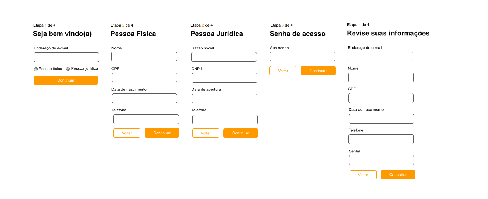

# Mercado Bitcoin

## Desafio

O desafio consistiu na criação de um formulário de múltiplas etapas (4 etapas), que fosse responsivo e utilizasse a menor quantidade de recursos externos possível.

## Layout

A imagem abaixo foi utilizada como referência de layout, conforme solicitado no enunciado.



## Stack Tecnológica

O projeto foi desenvolvido utilizando as seguintes tecnologias:

- **Vue 3** com Composition API utilizando JavaScript
- Recursos nativos do navegador como `localStorage` e `fetch API`
- **SASS** com a sintaxe SCSS para estilização
- **Vite** como bundler

## Estrutura do Projeto

O projeto foi desenvolvido de maneira simples e objetiva, com o intuito de demonstrar meus conhecimentos sobre o ciclo de desenvolvimento em Vue.js. A estrutura do projeto é a seguinte:

```
mercadobitcoin/
├── src/
│   ├── assets/         # Recursos adicionais da aplicação, como imagens e variáveis de estilo
│   ├── components/     # Componentes primitivos como botões e inputs
│   ├── helpers/        # Métodos de ajuda para uma função especifica que podem ser reaproveitados
│   ├── schema/         # Definição das propriedades do formulário
│   ├── services/       # Camada de abstração para consumo de APIs
│   └── App.vue         # Formulário renderizado diretamente no App.vue
├── package.json
└── vite.config.js
```

## Setup

Para configurar o projeto localmente, siga os passos abaixo:

1. Clone o repositório:
   ```sh
   git clone 'https://github.com/Daan-Cardoso/mercadobitcoin-teste'
   ```
2. Acesse o diretório do repositório:
   ```sh
   cd mercadobitcoin-teste
   ```
3. Instale as dependências utilizando npm ou yarn:
   ```sh
   npm install
   ```
   ou
   ```sh
   yarn install
   ```
   **Nota:** Para fins de desenvolvimento, foi utilizado `yarn`.

4. Execute o projeto:
   ```sh
   npm run dev
   ```
   ou
   ```sh
   yarn dev
   ```
   O projeto será iniciado na porta padrão do Vite (geralmente `http://localhost:3000`).

## Conclusão

Este projeto foi uma ótima oportunidade para demonstrar habilidades em Vue.js, trabalhando com um formulário multi-etapas, responsividade, e utilização mínima de recursos externos. A estrutura organizada e a escolha das tecnologias visam facilitar a manutenção e escalabilidade do código.
